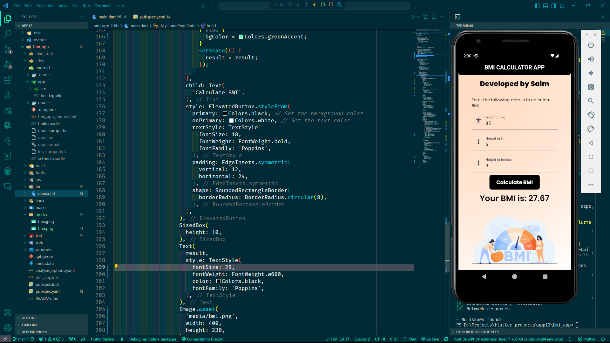

```markdown
# BMI Calculator App

A simple BMI (Body Mass Index) Calculator app developed using Flutter.

## Overview

This Flutter application calculates the BMI (Body Mass Index) based on the user's weight and height input. It provides a user-friendly interface for entering weight in kilograms and height in feet and inches. After entering the required details, the user can calculate their BMI by pressing the "Calculate BMI" button.

## Features

- Calculate BMI based on weight and height input
- User-friendly interface
- Immediate feedback on BMI calculation
- Visual indication of BMI status (color-coded)
```
## Screenshots


```
## Getting Started

To run this Flutter app on your local machine, follow these steps:

1. Install Flutter. For instructions, refer to the [official Flutter documentation](https://flutter.dev/docs/get-started/install).
2. Clone this repository to your local machine:

   ```bash
   git clone https://github.com/your-username/bmi_calculator_app.git
   ```

3. Navigate to the project directory:

   ```bash
   cd bmi_calculator_app
   ```

4. Run the app:

   ```bash
   flutter run
   ```

## Dependencies

This project uses the following dependencies:

- `flutter`: The Flutter SDK.
- `cupertino_icons`: Cupertino icons for iOS style icons.

These dependencies are specified in the `pubspec.yaml` file.

## Contribution

Contributions are welcome! Feel free to submit bug reports, feature requests, or pull requests.

## License

This project is licensed under the MIT License. See the [LICENSE](LICENSE) file for details.

```

Replace `your-username` with your actual GitHub username in the repository URL provided in the "Getting Started" section.

Feel free to customize this README.md file further to include additional information about your project, such as installation instructions, usage guidelines, or any other relevant details.
